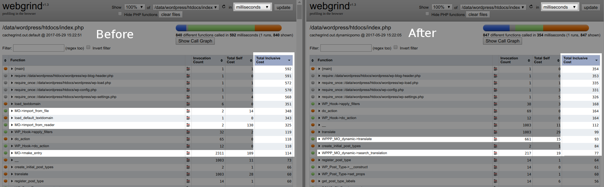

Dynamic MO Loader
=================

Changing the WordPress site language to any other than English slows down page generation times. A lot. This is caused by the slow and inefficient way of text domain loading. This plugin, based on the excellent work by Björn Ahrens, aims to fix that by loading only the text domains that are used in a page and even more, by caching them.

PO and MO files are designed to be used with PHP Gettext-extension. But since it's an extension, it's not installed by default on all hosting platforms. To overcome this barrier, WordPress has re-implemented the whole MO file parsing in PHP completely ignoring the possibility to use native gettext, if available. This WordPress' implementation is a bit slow.

This plugin has another implementation of MO parsing, which is faster than the default one. The plugin also loads only the text domains that are required to generate the current page instead the default behavior of loading every available text domain. As front end pages usually only use strings from few text domains, this leads to a great performance boost in front end.

To boost the performance even more, the plugin also caches the loaded text domains in to the object cache. For optimal performance you need a fast object cache backend like Redis, Memcached or APC(u).

## Numbers

These following experiments are conducted in a decent LEMP-server, using Nginx, MariaDB, php-fpm and Redis. The server has an SSD. This is the actual page generation time, not the server response time.

**Default WordPress install, php5:**
0 active plugins, Twentysixteen with default widgets etc.

                     en         fi          fi, cached
    front page       26ms       37ms        29ms
    post-new.php     47ms       81ms        61ms

**Real-life WordPress install, php5:**
15 active plugins, Twentysixteen with default widgets etc.

                     en         fi          fi, cached
    front page       95ms       165ms       101ms
    post-new.php     208ms      330ms       295ms

**Default WordPress install, php7:**
0 active plugins, Twentysixteen with default widgets etc.

                     en         fi          fi, cached
    front page       12ms       18ms        14ms
    post-new.php     27ms       43ms        37ms

**Real-life WordPress install, php7:**
15 active plugins, Twentysixteen with default widgets etc.

                     en         fi          fi, cached
    front page       54ms       62ms        55ms
    post-new.php     113ms      127ms       116ms

## Validation with Xdebug

The following screenshot visualizes how a the built-in WordPress translation functions are skipped and the optimized dynamic loader classes are used instead, resulting in almost a twice as fast load time.

## Inclusion in WordPress core

There are plans to implement native gettext in WordPress core. If that happens, this plugin will become obsolete. The [ticket #17268](https://core.trac.wordpress.org/ticket/17268) has however been open already for 6 years to it might not happen any soon though.

## License
GPLv2 or later
